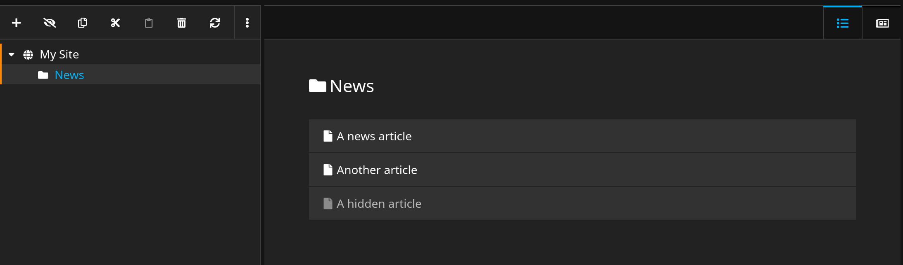

# Kleisli.Neos.DocumentCollection
:information_source: A tool to provide a backend list view to avoid large and confusing document subtrees 
that typically occur with news pages or blogs.


## Usage
### Fusion (Basic)
* To enable the list view on any Document NodeType, it must be based on `Kleisli.Neos.DocumentCollection:Document.DocumentCollection` 
instead of an AbstractPage prototype based on Neos.Neos:Page. 
* The page that is shown in the frontend has to be configured
as property `layoutView`. 
* The default view when you access a DocumentCollection in the backen is `list` but you can also 
define the property `defaultView = 'layout'`
  * You can switch between list and layout view using the icon tabs in the admin bar at the top of the page 
```
prototype(My.Site:Document.News) < prototype(Kleisli.Neos.DocumentCollection:Document.DocumentCollection) {
    defaultView = 'list'
    layoutView = My.Site:Document.AbstractPage {
        ... 
    }
}
```

### NodeTypes (Optional)
- Configure `Kleisli.Neos.DocumentCollection:Constraint.HideInDocumentTree`as a superType of your news article or 
blog post NodeType to hide them in the document tree. They can then only be accessed from the DocumentCollection 
views.
- superType `Kleisli.Neos.DocumentCollection:Document.DocumentCollection`  dosen't do much, but it defines the folder icon.

## Example
You can find a basic example of the usage in `NodeTypes/Document/Example` and `Resources/Private/Fusion/Document/Example`.
To test it, you can just define the example NodeTypes as not abstract.

## Todo
- [ ] Pagination
- [ ] Sorting
- [ ] Filter
- [ ] Add document button in list view
